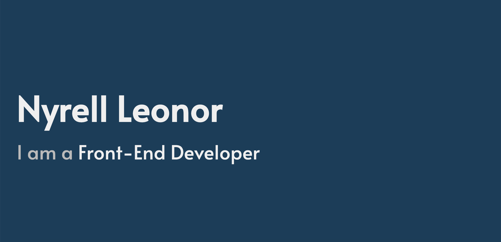

### Welcome to my github! 👋

## Who I Am 💬
I'm a self-taught Front-End Developer! I first started studying front-end development in November of 2021 starting with HTML and CSS. As I got more confident with those technologies I eased myself into learning the interactive side of front-end by using JavaScript in my projects. I wanted to verify what I learned right away so I created beginner challenges on Front End Mentor[https://www.frontendmentor.io/home]. This is largely where I progressed as a developer. 

I really valued the concept of learn by doing, therefore I decided if I were to study all these front-end technologies I need to apply what I've learned into tangible results. As a result, I have various projects that I can showcase on my github and website! (which I designed and developed myself!). All of my projects are finished, but there is ALWAYS room for improvement which is a great thing about this profession. *Things can ALWAYS be better*

## Current Skills 🌱 
- HTML: The building block of the web. The skeletal structure of the web.
- CSS: The styling language for the web.
- SASS/SCSS: CSS pre-processor. This helps me to better organize my styling and its readability
- JavaScript: Object oriented programming language. Allows for interactivity of a webpage
- TypeScript: This is a super-set of JavaScript. This allows for developers to explicitly add types to JavaScript. This prevents further errors especially in large projects.
- React: A JavaScript library created by Meta. This is a component based library developers use to create scalable and solid User Interfaces quickly and efficiently
- Visual Studio Code: A code editor created and maintained by Microsoft. A great tool for developers to write their code and create projects
- Git: A distributed version control systems. This allows for developers to make changes to their code and track it throught the life-cycle of a project. Especially important when working with large codebases.

## I’m currently working on 🔭 

Now, I am currently learning React and TypeScript and implementing them into my projects! For example, I am creating this web application that people can visit if they want to learn more about how to invest and increase their financial literacy! In this application I provide various resources from financial institutions and websites. It is like a one-stop-shop of resources that ONLY pertains to finance, so that the user doesn't have to dig through which resources are the best or worst, my application provides the basis for the best places they can start from saving them time from researching from scratch!

Additionally, I am creating my first REST API! This API is a quote API that will have various quotes from different people across, history, politics, and media. My goal for this API is to be able to use it for a quote generator application I plan to build, this quote generator will infinitely loop through all the quote data in the API and will display to the user everytime they open it. The quotes will all be inspirational quotes about, life, careers, and people. In a world where we are constantly doubting ourselves, having a constant external validation one can go to and read to uplift themselves can have a really big impact in how we carry ourselves. That's the effect I want to generate building this API and quote app!

<!--
**nyrellcl/nyrellcl** is a ✨ _special_ ✨ repository because its `README.md` (this file) appears on your GitHub profile.

Here are some ideas to get you started:

-   ...
- I’m currently learning ...
- 👯 I’m looking to collaborate on ...
- 🤔 I’m looking for help with ...
-  Ask me about ...
- 📫 How to reach me: ...
- 😄 Pronouns: ...
- ⚡ Fun fact: ...
-->
